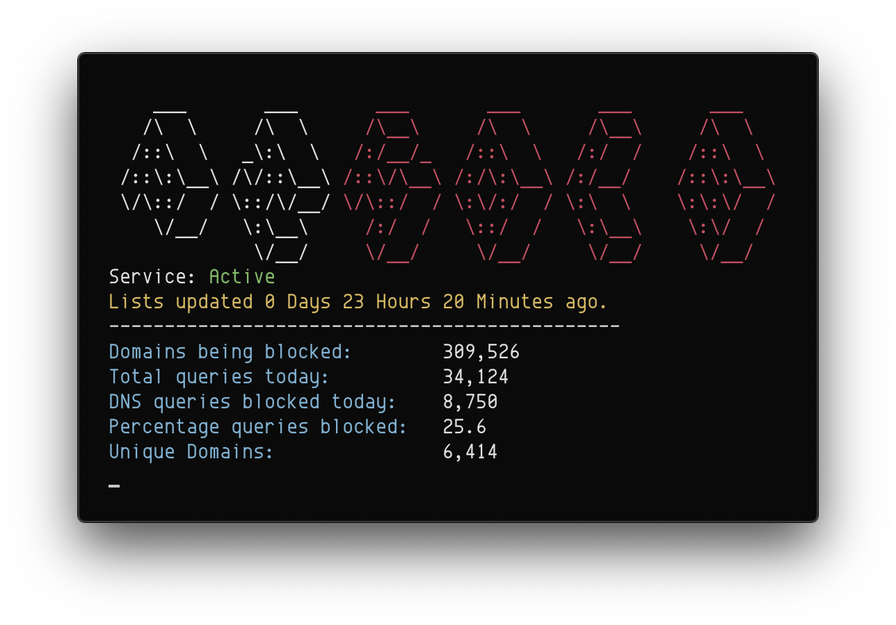

## Pi-Hole Status

Simple script written uses curses to print information from your pi-hole on your terminal without needing to SSH into your pi or havin to open the web interface. Script refreshes once every 30 seconds, should work on linux and macOS.



Installation instructions:

Make sure you have python3 installed
```sh

$ git clone https://github.com/mnk400/holeinfo
$ cd holeinfo
$ make install
```

Usagae:

```
$ holeinfo
```


